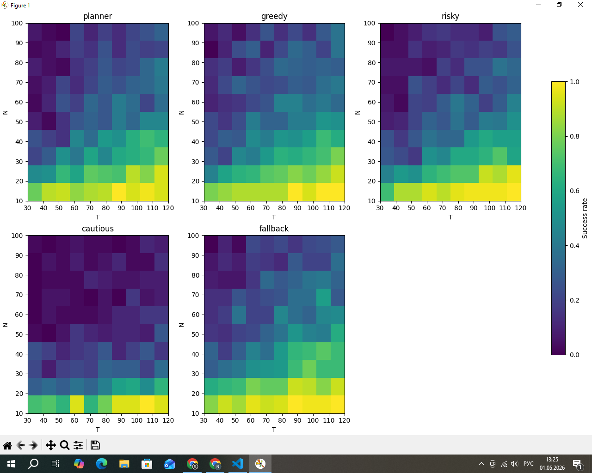
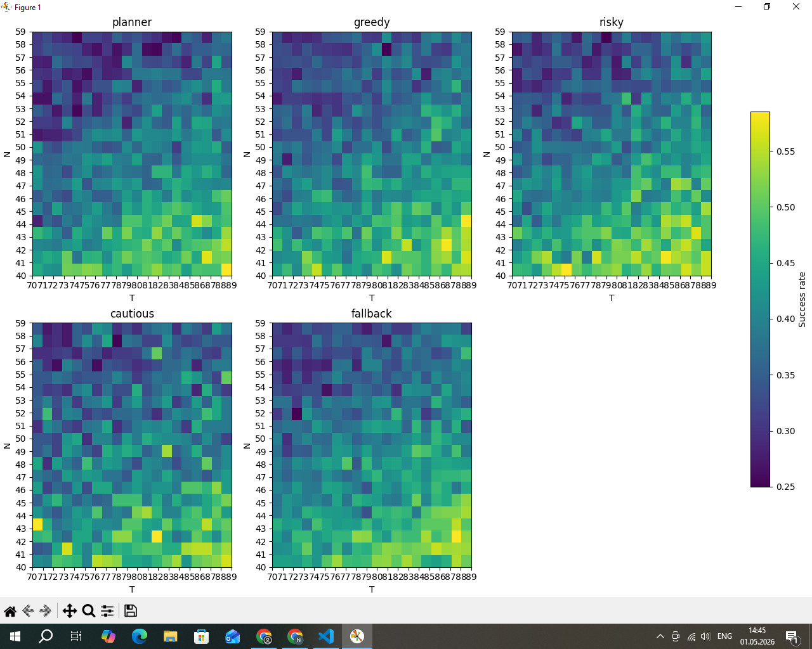

# multi-agent-routing-in-failing-networks
Simulation of multi-agent navigation strategies in dynamic graphs with probabilistic edge failures and recovery

## Introduction

This study models the behavior of agents in a dynamically changing network. The goal is to identify the most survivable movement strategy in a graph where edges can disappear and reappear randomly.

The model was tested on graphs ranging from N=10 to N=100 vertices. Larger graphs would require significantly more computational resources than were available for this study.

## Agents

The simulation uses 5 agents with different behavioral strategies:

Planner — uses a dynamic BFS-based approach toward the goal. At each step it computes a local shortest path and moves to the next node on that path. To avoid loops, it keeps a short history of recently visited nodes and, if the recommended move would repeat a recent state or become unreliable, it switches to the best alternative neighbor based on distance to the goal.

Greedy — at each step selects the neighboring vertex that is closest to the goal according to the current BFS distance map. It avoids recently visited nodes when possible, but otherwise makes the best locally optimal move without any forward planning.

Risky — behaves like a greedy agent most of the time, choosing the neighbor that minimizes distance to the goal. However, with a 20% probability, it ignores optimization and makes a random move, introducing stochastic exploration. It does not actively avoid revisiting nodes.

Cautious — prefers neighbors connected through edges with low estimated risk of failure. Among these safe neighbors, it chooses the one closest to the goal. If no safe moves are available, it either stays in place or moves randomly with low probability. This makes it conservative in edge selection even at the cost of longer paths.

Fallback — acts like a greedy agent, always selecting the neighboring node closest to the goal when possible. If no valid path information exists (i.e., all neighbors are unreachable in the BFS sense), it falls back to random movement among available neighbors. It does not explicitly switch strategies or evaluate long-term inefficiency.

## Methodology

### Main Experiment

The simulation was run on random connected graphs with N=10 to N=100 vertices (step 10) and a step limit of T=30 to T=120 (step 10). Each configuration was run 50 times. At each step, any edge may disappear with 30% probability or reappear with 10% probability. This ratio was chosen intentionally — the graph gradually degrades over time.

Only configurations where T > N were analyzed — meaning the agent has a real buffer of steps relative to graph size. Configurations where T ≤ N are trivially unsolvable even without edge failures and carry no information about strategy effectiveness.

### Secondary Experiment

To investigate the transition zone in greater detail, a secondary experiment was conducted with step size 1 on both axes: N from 40 to 59, T from 70 to 89. Each configuration was run 200 times. This allowed studying agent behavior in the medium difficulty range at higher resolution.

## Results

### Main Experiment

Results are presented as survival rate heatmaps for each strategy separately.

Planner — bright only at N=10-20. Already noticeably dark at N=30 even with large T. At N≥40 almost entirely dark despite step buffer. The strategy does not scale with graph size.

Greedy — the widest bright zone of all strategies. Yellow at N=10-20, green at N=30, still holding at N=40. The smoothest gradient — the most stable strategy across a wide range of conditions.

Risky — yellow at N=10-20 like Greedy, but noticeably patchier and more irregular at N=30-40. Less predictable.

Cautious — the darkest of all even in the T>>N zone. A large step buffer does not help — waiting for a safe path still exhausts the step limit.

Fallback — better than Cautious, worse than Greedy. Middle position with no clear advantages.

### Secondary Experiment

Results of the secondary experiment are presented as a heatmap.

In the range N=40-59, T=70-89, overall survival rate falls between 0.25 and 0.55 for all strategies. Greedy and Risky show the best peaks in the lower part of the range (N=40-42). Planner is the worst — mostly 0.25-0.35. Cautious is consistently average with no clear peaks. Fallback shows high variance.

It should be noted that with step size 1 and 200 rounds, results are quite noisy — reliable conclusions at this resolution would require significantly more rounds, which exceeds the computational resources available for this study.

## Conclusions

The study showed that in a dynamically degrading network there is no universally optimal strategy — the effectiveness of each agent depends heavily on the ratio of graph size N to step limit T.

Greedy proved to be the most stable strategy across a wide range of conditions. Its advantage lies in simplicity — the agent does not waste steps on complex calculations and moves locally toward the goal.

Planner is effective only on small graphs with sufficient steps. As N increases, recalculating the optimal route at every step becomes too costly and the agent fails to reach the goal in time.

Risky shows high survival peaks but with high variance. Can be effective under favorable conditions but unreliable due to unpredictability.

Cautious is the worst strategy in all tested conditions. Waiting for a safe path systematically exhausts the step limit even with a large time buffer.

Fallback occupies a middle position but falls behind Greedy in stability.

Overall conclusion: in a dynamic environment with a limited time budget, simplicity and local adaptability outperform complex planning.

It should be noted that due to limited computational resources, the number of rounds in some configurations is relatively small, introducing a degree of noise into the results. More reliable conclusions would require 500+ rounds per configuration.

## Files

simulation_visual.py — visual simulation mode. Watch agents moving across the graph in real time along with a live histogram of results. All parameters can be configured at the top of the file.

simulation_heatmap.py — heatmap generation mode. Runs the simulation across a range of graph sizes N and step limits T and produces survival rate heatmaps for each strategy. All parameters can be configured at the top of the file.

